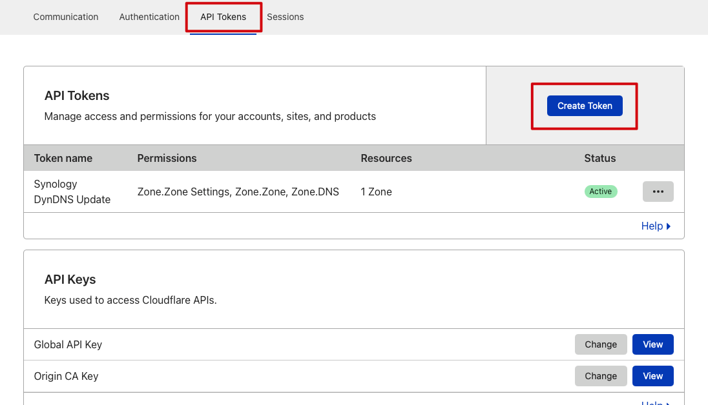
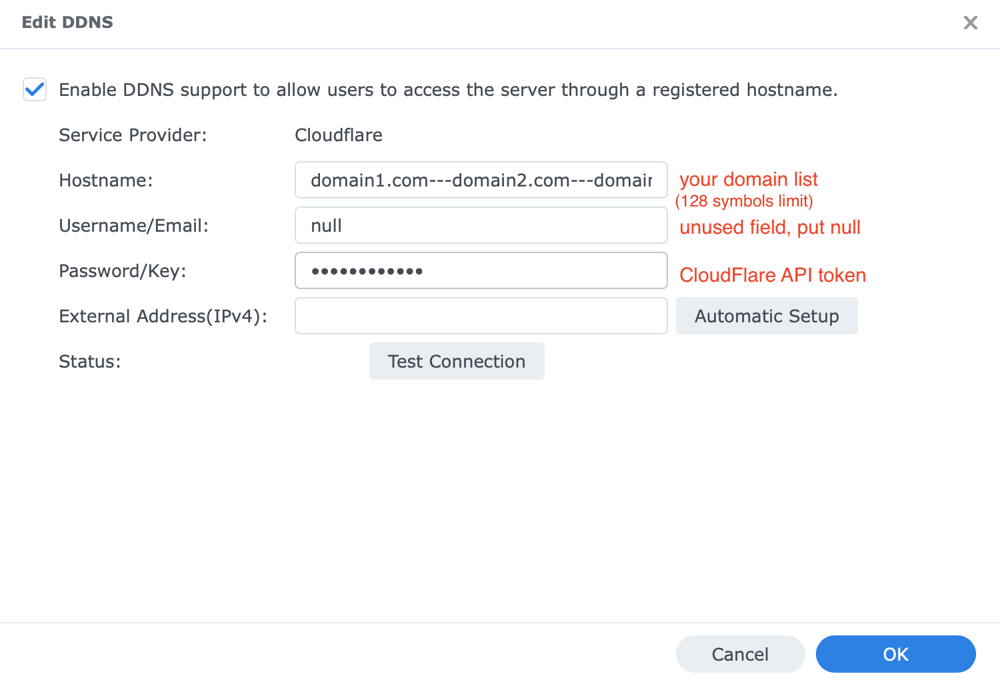

# Synology Dynamic DNS with Cloudflare for both multidomains and subdomains

## Table of contents

* [What this script does](#what-this-script-does)
* [Before you begin](#before-you-begin)
* [How to install](#how-to-install)
* [Troubleshooting and known issues](#troubleshooting-and-known-issues)
  + [Connection test failed or error returned](#connection-test-failed-or-error-returned)
  + [Cloudflare no longer listed as a DDNS provider after a DSM update](#cloudflare-no-longer-listed-as-a-ddns-provider-after-a-dsm-update)
* [Default Cloudflare ports](#default-cloudflare-ports)
* [Debug script](#debug)


## What this script does

* A PHP script for Synology DSM (and potentially Synology SRM devices) adding support for Cloudflare to Network Centre > Dynamic DNS (DDNS).
* Supports single domains, multidomains, subdomains and regional domains, or any combination thereof (example: dev.my.domain.com.au, domain.com.uk etc)
* Easy instalation process
* Based on CloudFlare API v4
* [Supports dual stack IPv4 and IPv6](https://github.com/mrikirill/SynologyDDNSCloudflareMultidomain/pull/13)

## Before you begin

Before starting the installation process, make sure you have (and know) the following information, or have completed these steps:

 1. *Cloudflare credentials*
 
	 a. Know your Cloudflare account username (or [register for an account if you're new to Cloudflare](https://dash.cloudflare.com/sign-up)); and
	 
	 b. Have your [API key](https://dash.cloudflare.com/profile/api-tokens) - no need to use your Global API key! (More info: [API keys](https://support.cloudflare.com/hc/en-us/articles/200167836-Managing-API-Tokens-and-Keys)).

	

	 c. Create a API key with following (3) permissions:
	 
	 **Zone** > **Zone.Settings** > **Read**  
	 **Zone** > **Zone** > **Read**  
	 **Zone** > **DNS** > **Edit**  

	 The affected zone ressouces have to be (at least):

	**Include** > **All zones from an account** > `<domain>`  

 2. *DNS settings:*
 
	Ensure the DNS A record(s) for the domain/zone(s) you wish to update with this script have been created (More information: [Managing DNS records](https://support.cloudflare.com/hc/en-us/articles/360019093151-Managing-DNS-records-in-Cloudflare)).

	Your DNS records should appear (or already be setup as follows) in Cloudflare:
	
	(Note: Having Proxied turned on for your A records isn't necessary, but it will prevent those snooping around from easily finding out your current IP address)

	

## How to install

1. **Activate SSH on your supported device:**

	 a. For DSM Users:
	 
	 Navigate to __Control Panel > Terminal & SNMP > Enable SSH service__
	 
	 b. For SRM users:
	 
	 Navigate to __Control Panel > Services > System Services > Terminal > Enable SSH service__
	 
	

2. **Connect via SSH:** Connect to your supported device via SSH and execute command

* For DSM Users
  ```
  wget https://raw.githubusercontent.com/mrikirill/SynologyDDNSCloudflareMultidomain/master/cloudflare.php -O /usr/syno/bin/ddns/cloudflare.php && sudo chmod 755 /usr/syno/bin/ddns/cloudflare.php
  ```

* For SRM Users
  Note: Ensure you are connected as root in your SSH session
  ```
  wget https://raw.githubusercontent.com/mrikirill/SynologyDDNSCloudflareMultidomain/master/cloudflare.php -O /usr/syno/bin/ddns/cloudflare.php && chmod 755 /usr/syno/bin/ddns/cloudflare.php
  ```

	**Note:** For SRM users, you must connect to your device as root. No other username will allow these commands to run.

3. **Update DDNS provider list:** Using your preferred/available command line editor, insert the text below to your DMS file (Location : __/etc.defaults/ddns_provider.conf__), to add DDNS support via Cloudflare:

	```
	[Cloudflare]
	  modulepath=/usr/syno/bin/ddns/cloudflare.php
	  queryurl=https://www.cloudflare.com/
	 ```

	 **Note:** For SRM users, break out this [Vim cheat sheet](https://coderwall.com/p/adv71w/basic-vim-commands-for-getting-started), as it's the only text editor available to you.
 
4. **Update your DDNS settings:** 

	 a. *For DSM Users:* Navigate to __Control Panel > External Access > DDNS__ then add new DDNS
	 
	 b. *For SRM users:* Navigate to __Network Centre > Internet > QuickConnect & DDNS > DDNS__ and press the Add button:

	Add/Update the DDNS settings screen as follows:

	* Service provider: Select Cloudflare
	* Hostname:
 For a single domain: __mydomain.com__
For multiple domains: __subdomain.mydomain.com---vpn.mydomain.com__
	(ensure each domain is seperated by three dashes: ---)
	* Username: The email address you use for logging in to Cloudflare (optional since the API key is sufficient)
	* Password: Your created Cloudflare API Key

	

	Finally, press the test connection button to confirm all information is correctly entered, before pressing Ok to save and confirm your details.

5. Enjoy 🍺 and __don't forget to deactivate SSH (step 1) if you don't need it__.

## Troubleshooting and known issues

### Connection test failed or error returned

This will manifest as either 1020 error; or the update attempt not showing in your Cloudflare Audit logs.

That generally means you may not have entered something correctly in the DDNS screen for your domain(s).

Revisit [Before you begin](#before-you-begin) to ensure you have all the right information, then go back to Step 4 in [How to install](#how-to-install) to make sure everything is correctly entered.

**Handy hint:** You can also check your Cloudflare Audit logs to see what - if anything - has made it there with your API key (More information: [Understanding Cloudflare Audit Logs](https://support.cloudflare.com/hc/en-us/articles/115002833612-Understanding-Cloudflare-Audit-Logs)). Updates using the API will appear in the Audit logs as a Rec Set action.

### Cloudflare no longer listed as a DDNS provider after DSM or SRM updates

After system updates to either Synology DSM or SRM, you may find that:
* __/usr/syno/bin/ddns/cloudflare.php__ has been deleted;
* __/etc.defaults/ddns_provider.conf__ was reset to its default settings (settings for Cloudflare no longer included); and
* The DDNS settings in your DDNS panel constantly show Cloudflare's status as loading.

If this occurs, simply [repeat the How to install steps](#how-to-install) shown above.

## Default Cloudflare ports
Source [Identifying network ports compatible with Cloudflare's proxy](https://support.cloudflare.com/hc/en-us/articles/200169156-Identifying-network-ports-compatible-with-Cloudflare-s-proxy)

|HTTP ports supported by Cloudflare  | HTTPS ports supported by Cloudflare |
|--|--|
| 80 | 443 |
| 8080 | 2053 | 
| 8880 | 2083 |
| 2052 | 2087 | 
| 2082 | 2096 |
| 2086 | 8443 | 
| 2095 | |

## Debug

You can run this script directly to see output logs

* SSH into your Synology system 

* Run this command: 

```
/usr/bin/php -d open_basedir=/usr/syno/bin/ddns -f /usr/syno/bin/ddns/cloudflare.php "" "your-CloudFlare-token" "your---domains---divided---by---dashes" "ip-address"
```

* Check output logs

## Credits

<small><i><a href='http://ecotrust-canada.github.io/markdown-toc/'>Table of contents generated with markdown-toc</a></i></small>  
<small><i><a href='https://www.youtube.com/watch?v=Nf7m3h11y-s'>DB Tech - creating API keys and using Cloudflare CNAME for single updates</a></i></small>
